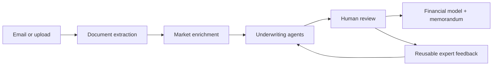

<p align="center">
  <a href="https://github.com/wusterbuilds/plumb-platform/actions/workflows/ci.yml"></a>
  <a href="LICENSE"></a>
  <a href="CONTRIBUTING.md"></a>
</p>

# Plumb Platform

Plumb Platform is an open-source, AI-native back office for commercial-real-estate capital advisory. It turns inbound deal documents into structured underwriting, reviewable risk findings, financial models, and lender-facing deliverables.

The core idea is simple: expert corrections should not disappear into email threads. Plumb records the evidence, decisions, and redlines that make the next deal better.

## See Plumb Platform in action

A three-minute walkthrough of document intake, agent-led underwriting, human
review, memorandum generation, and lender matching:

https://github.com/user-attachments/assets/7f28b406-9965-49e6-ae3b-b58930acd22c

*Narration uses a synthetic, non-imitative voice; the product workflow shown is unchanged.*

> **Project status:** research-quality alpha. It is suitable for local evaluation with synthetic documents, not unattended production underwriting.

## Workflow



## What is included

- FastAPI service with deal, document, extraction, risk, financial, and review APIs.
- Agent orchestration with progress events and auditable tool calls.
- PostgreSQL persistence, Redis/Celery jobs, and S3-compatible document storage.
- Next.js review workspace for deals, findings, redlines, knowledge, lenders, and metrics.
- Optional Gmail intake and reply workflow.
- Synthetic tests and fixture conventions; no customer deal package is included.

## Quick start

Prerequisites: Python 3.11+, [uv](https://docs.astral.sh/uv/), Node.js 20+, Docker, and an Anthropic API key.

Start infrastructure and the API:

```bash
git clone https://github.com/wusterbuilds/plumb-platform.git
cd plumb-platform/plumb-app
cp .env.example .env
docker compose up -d
uv sync
uv run alembic upgrade head
uv run uvicorn app.main:app --reload
```

Start the review UI in another terminal:

```bash
cd plumb-ui
npm ci
npm run dev
```

Open `http://localhost:3000`. API documentation is available at `http://localhost:8000/docs`.

Background agent runs use the Celery worker defined in `plumb-app/app/worker.py`; start it when exercising asynchronous pipelines.

## Repository map

| Path | Purpose |
| --- | --- |
| [`plumb-app`](plumb-app) | FastAPI application, worker, agent pipeline, models, and tests |
| [`plumb-ui`](plumb-ui) | Next.js review workspace |
| [`docs`](docs) | Architecture and public project documentation |

## Data safety

- Use synthetic or properly licensed documents while evaluating the project.
- Never commit customer documents, OAuth tokens, credentials, generated memoranda, or production `.env` files.
- Demo-directory environment variables must point only to local synthetic fixtures.
- LLM-generated analysis requires expert review and is not investment, legal, tax, or credit advice.

The public history was intentionally rebuilt before launch to exclude private deal material and internal strategy documents.

## Development

```bash
cd plumb-app
uv run pytest

cd ../plumb-ui
npm run lint
npm run build
```

See [CONTRIBUTING.md](CONTRIBUTING.md), [SECURITY.md](SECURITY.md), and the public [architecture overview](docs/architecture.md).

## License

MIT. See [LICENSE](LICENSE).
